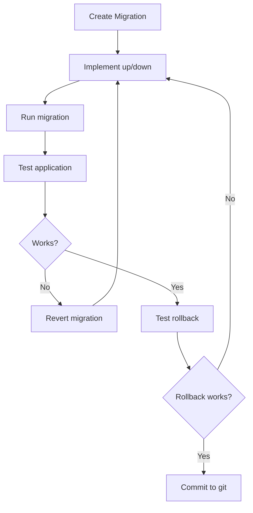
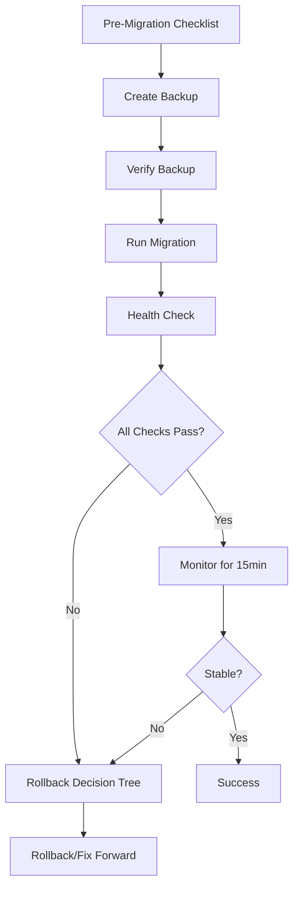

# Database Migration Guide

This guide covers safe database migration practices for Station, designed for solo maintainer operations with emphasis on safety and recoverability.

## Table of Contents

- [Quick Start](#quick-start)
- [Migration Workflow](#migration-workflow)
- [Rollback Decision Tree](#rollback-decision-tree)
- [Common Scenarios](#common-scenarios)
- [Best Practices](#best-practices)
- [Troubleshooting](#troubleshooting)

## Quick Start

### Creating a New Migration

```bash
# 1. Generate migration file
npm run typeorm migration:create src/migrations/YourMigrationName

# 2. Copy template structure
# Use src/migrations/templates/migration-template.ts as a guide

# 3. Implement up() and down() methods

# 4. Test in development
npm run typeorm migration:run
npm run typeorm migration:revert  # Test rollback
```

### Running Migrations Safely

```bash
# 1. Create backup
npm run db:backup

# 2. Review checklist
# Fill out src/migrations/templates/PRE_MIGRATION_CHECKLIST.md

# 3. Run migration
npm run typeorm migration:run

# 4. Run health check
npm run db:health-check

# 5. If issues, rollback immediately
npm run typeorm migration:revert
```

## Migration Workflow

### Development Environment



### Production Environment



## Rollback Decision Tree

Use this flowchart when a migration fails or causes issues:

### Step 1: Assess the Situation

**Is the migration still in progress?**

- ✅ **Yes** → Cancel and rollback immediately
  ```bash
  # Stop migration (Ctrl+C if running)
  npm run typeorm migration:revert
  ```
- ❌ **No** → Continue to Step 2

### Step 2: Check Data Changes

**Has user data changed since migration started?**

- ✅ **Yes** → Can the changes be lost?
  - **Yes** → Safe to rollback → Go to Step 4
  - **No** → **Critical** → Go to Step 3
- ❌ **No** → Safe to rollback → Go to Step 4

### Step 3: Application Status

**Is the application completely broken?**

- ✅ **Yes** → Restore from backup immediately
  ```bash
  npm run db:restore -- backups/[latest-backup].sql
  ```
- ❌ **No** → Go to Step 5

### Step 4: Simple Rollback

```bash
# 1. Revert migration
npm run typeorm migration:revert

# 2. Verify health
npm run db:health-check

# 3. Restart application
npm run start

# 4. Confirm application works
```

### Step 5: Fix Forward Decision

**Can the issue be fixed with a hotfix migration?**

- ✅ **Yes** → Create hotfix migration

  ```bash
  # 1. Create hotfix
  npm run typeorm migration:create src/migrations/HotfixIssue

  # 2. Implement fix
  # 3. Run hotfix migration
  npm run typeorm migration:run
  ```

- ❌ **No** → Rollback (Step 4) or Restore (Step 3)

## Common Scenarios

### Scenario 1: Adding a New Table

**Risk Level**: Low
**Rollback**: Easy (just drop table)
**Backup Required**: Yes (always)

**Example**:

```typescript
public async up(queryRunner: QueryRunner): Promise<void> {
  await queryRunner.createTable(
    new Table({
      name: 'example_table',
      columns: [
        {
          name: 'id',
          type: 'int',
          isPrimary: true,
          isGenerated: true,
          generationStrategy: 'increment',
        },
        {
          name: 'name',
          type: 'varchar',
          length: '255',
        },
      ],
    }),
    true,
  );
}

public async down(queryRunner: QueryRunner): Promise<void> {
  await queryRunner.dropTable('example_table');
}
```

### Scenario 2: Adding a Column (Nullable)

**Risk Level**: Low
**Rollback**: Easy
**Backup Required**: Yes

**Example**:

```typescript
public async up(queryRunner: QueryRunner): Promise<void> {
  await queryRunner.addColumn(
    'user',
    new TableColumn({
      name: 'phone_number',
      type: 'varchar',
      length: '20',
      isNullable: true,
    }),
  );
}

public async down(queryRunner: QueryRunner): Promise<void> {
  await queryRunner.dropColumn('user', 'phone_number');
}
```

### Scenario 3: Adding a Column (NOT NULL with Default)

**Risk Level**: Medium
**Rollback**: Moderate (data loss on rollback)
**Backup Required**: Yes (critical)

**Example**:

```typescript
public async up(queryRunner: QueryRunner): Promise<void> {
  // Add column as nullable first
  await queryRunner.addColumn(
    'user',
    new TableColumn({
      name: 'status',
      type: 'varchar',
      length: '50',
      isNullable: true,
    }),
  );

  // Populate with default value
  await queryRunner.query(`
    UPDATE "user"
    SET "status" = 'active'
    WHERE "status" IS NULL
  `);

  // Make NOT NULL
  await queryRunner.changeColumn(
    'user',
    'status',
    new TableColumn({
      name: 'status',
      type: 'varchar',
      length: '50',
      isNullable: false,
      default: "'active'",
    }),
  );
}

public async down(queryRunner: QueryRunner): Promise<void> {
  await queryRunner.dropColumn('user', 'status');
  // WARNING: Data in 'status' column will be lost
}
```

### Scenario 4: Data Migration

**Risk Level**: High
**Rollback**: Complex (requires data reversal)
**Backup Required**: Yes (mandatory)

**Example**:

```typescript
public async up(queryRunner: QueryRunner): Promise<void> {
  // Transform data
  await queryRunner.query(`
    UPDATE "organization"
    SET "settings" = jsonb_set(
      COALESCE("settings", '{}'::jsonb),
      '{theme}',
      '"dark"'
    )
    WHERE "settings"->>'theme' IS NULL
  `);
}

public async down(queryRunner: QueryRunner): Promise<void> {
  // Reverse transformation
  await queryRunner.query(`
    UPDATE "organization"
    SET "settings" = "settings" - 'theme'
    WHERE "settings"->>'theme' = 'dark'
  `);
  // NOTE: Cannot distinguish between newly added
  // and pre-existing dark themes
}
```

### Scenario 5: Irreversible Migration

**Risk Level**: Critical
**Rollback**: Restore from backup only
**Backup Required**: Yes (mandatory + verified)

**Example**:

```typescript
/**
 * WARNING: This migration is irreversible!
 * Rollback requires database restore from backup.
 *
 * Reason: Combines two columns into one with data transformation
 */
public async up(queryRunner: QueryRunner): Promise<void> {
  // Combine first_name and last_name into full_name
  await queryRunner.query(`
    ALTER TABLE "user"
    ADD COLUMN "full_name" VARCHAR(255)
  `);

  await queryRunner.query(`
    UPDATE "user"
    SET "full_name" = CONCAT("first_name", ' ', "last_name")
  `);

  await queryRunner.dropColumn('user', 'first_name');
  await queryRunner.dropColumn('user', 'last_name');
}

public async down(queryRunner: QueryRunner): Promise<void> {
  throw new Error(
    'This migration is irreversible. Restore from backup to rollback.'
  );
}
```

## Best Practices

### 1. Always Write Rollback Methods

Every migration MUST have a working `down()` method. If impossible, throw an error with clear instructions.

### 2. Test Rollbacks

```bash
# In development, always test:
npm run typeorm migration:run
npm run typeorm migration:revert  # Must succeed
npm run typeorm migration:run     # Run again
```

### 3. Use Transactions

TypeORM migrations run in transactions by default. Don't disable unless necessary.

```typescript
// Migrations are wrapped in transaction automatically
public async up(queryRunner: QueryRunner): Promise<void> {
  // All changes are atomic
  await queryRunner.createTable(...);
  await queryRunner.createIndex(...);
  // If any fails, all rollback
}
```

### 4. Make Migrations Idempotent

Migrations should be safe to run multiple times:

```typescript
// Good: Check before creating
public async up(queryRunner: QueryRunner): Promise<void> {
  const tableExists = await queryRunner.hasTable('example');
  if (!tableExists) {
    await queryRunner.createTable(...);
  }
}

// Bad: Will fail if run twice
public async up(queryRunner: QueryRunner): Promise<void> {
  await queryRunner.createTable(...);  // Error if table exists
}
```

### 5. Minimize Downtime

For zero-downtime migrations:

1. **Make changes backward compatible**
   - Add nullable columns first
   - Populate in separate migration
   - Make NOT NULL in third migration

2. **Use feature flags**
   - Deploy code with feature flag OFF
   - Run migration
   - Enable feature flag

### 6. Document Data Loss

If rollback causes data loss, document it:

```typescript
/**
 * Rollback Data Loss Warning:
 * - All data in the 'phone_number' column will be lost
 * - Cannot recover user verification status
 *
 * If rollback is needed, consider:
 * 1. Export data before rollback
 * 2. Restore from backup instead
 */
public async down(queryRunner: QueryRunner): Promise<void> {
  await queryRunner.dropColumn('user', 'phone_number');
}
```

### 7. Performance Considerations

Large migrations can lock tables. For big datasets:

```typescript
// Bad: Locks entire table
await queryRunner.query(`
  UPDATE "user" SET "status" = 'active'
`);

// Good: Batch processing
const batchSize = 1000;
let offset = 0;
while (true) {
  const result = await queryRunner.query(`
    UPDATE "user"
    SET "status" = 'active'
    WHERE id IN (
      SELECT id FROM "user"
      WHERE "status" IS NULL
      LIMIT ${batchSize}
      OFFSET ${offset}
    )
  `);

  if (result.affectedRows === 0) break;
  offset += batchSize;
}
```

## Troubleshooting

### Migration Fails Halfway

**Symptoms**: Migration crashes, partial schema changes

**Solution**:

1. Check if transaction rolled back automatically (TypeORM default)
2. If partial changes exist, manually revert:
   ```bash
   npm run typeorm migration:revert
   ```
3. Fix the migration code
4. Run again

### Migration Runs But Application Breaks

**Symptoms**: Migration succeeds, health check passes, but application errors

**Solution**:

1. Check application logs for specific errors
2. Verify entity definitions match new schema
3. If critical, rollback:
   ```bash
   npm run typeorm migration:revert
   ```
4. Fix entity/repository code
5. Redeploy and run migration

### Cannot Rollback

**Symptoms**: `migration:revert` fails

**Solution**:

1. Check error message
2. If data constraint issue, manually resolve:

   ```bash
   # Connect to database
   psql -h localhost -U stationDbUser -d stationDb

   # Fix constraint manually
   # Then retry revert
   ```

3. If impossible to fix, restore from backup:
   ```bash
   npm run db:restore -- backups/[backup-file].sql
   ```

### Slow Migration

**Symptoms**: Migration takes longer than expected

**Solution**:

1. Cancel if still running (Ctrl+C)
2. Check query execution plan:
   ```sql
   EXPLAIN ANALYZE [your query];
   ```
3. Add indexes before data transformation
4. Use batching for large updates
5. Consider maintenance window

## Performance Targets

- **Backup creation**: < 60 seconds for 1GB database
- **Health check**: < 10 seconds
- **Simple rollback**: < 30 seconds
- **Table creation**: < 5 seconds
- **Index creation**: Varies (< 1 min for small tables)

## Emergency Contacts

- **Database Admin**: [Your contact]
- **DevOps**: [Your contact]
- **On-call**: [Your rotation]

## Audit Trail

All migrations must be tracked:

- Git commit with migration file
- Completed PRE_MIGRATION_CHECKLIST.md
- Health check results
- Any issues encountered

---

**Last Updated**: 2025-12-02
**Maintained By**: Station Backend Team
